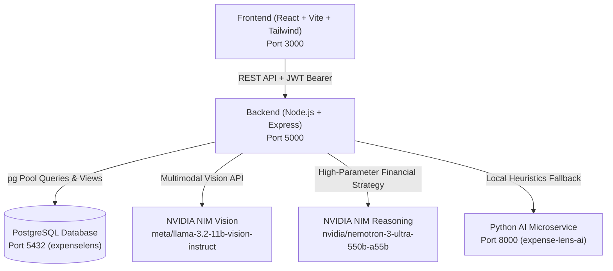

# ExpenseLens — Complete System & Architecture Understanding

This document provides a comprehensive technical overview of **ExpenseLens**: its end-to-end architecture, database design, feature catalog, AI model integrations, and an analysis of **single-receipt vs. multi-row ledger vision extraction**.

---

## 1. High-Level Architecture & Tech Stack



| Layer | Technologies | Purpose |
|---|---|---|
| **Frontend** | React 18, Vite, Tailwind CSS, Lucide Icons, react-i18next | Responsive UI with real-time analytics, charts, bilingual support (EN/HI), receipt scanner, CSV parser |
| **Backend** | Node.js, Express, `pg`, JWT, bcryptjs, node-cron, Multer | RESTful API, authentication, anomaly detection daemon, AI orchestration, SQL aggregations |
| **Database** | PostgreSQL 16 (`expenselens`) | ACID-compliant relational storage with custom SQL views, UUID primary keys, and soft deletes |
| **AI Layer** | NVIDIA NIM Cloud API (`nvapi-...`) + Python FastAPI microservice | Vision OCR + 550B financial advisor |

---

## 2. Directory Structure

```text
ExpenseLens/
├── backend/
│   ├── src/
│   │   ├── controllers/         # auth, transactions, categories, dashboard, budgets, savings, ai
│   │   ├── db/
│   │   │   ├── pool.js          # PostgreSQL connection pool
│   │   │   └── queries/         # SQL query definitions
│   │   ├── middleware/          # auth (JWT validation), errorHandler
│   │   ├── routes/              # Express route registrations
│   │   ├── services/
│   │   │   ├── aiService.js     # NVIDIA NIM (Vision + Nemotron) & Python AI bridge
│   │   │   └── anomalyDetection.js # Trailing 6-month statistical anomaly detector
│   │   ├── app.js               # Express application configuration
│   │   └── server.js            # Server entry point + CRON anomaly detector
│   └── .env                     # PORT=5000, DB config, NVIDIA_API_KEY, JWT_SECRET
│
├── frontend/expense-analyzer/expense-analyzer/
│   ├── src/
│   │   ├── components/          # Header, Sidebar, LanguageSwitcher, StatCard, Charts, Modal
│   │   ├── context/             # AuthContext (JWT session), ExpenseContext (live cache & refresh)
│   │   ├── locales/             # en & hi translation dictionaries
│   │   ├── pages/
│   │   │   ├── Dashboard.jsx         # Summary cards, charts, budget gauge, recent expenses
│   │   │   ├── Expenses.jsx          # Filterable, sortable, paginated transaction ledger
│   │   │   ├── AddExpense.jsx        # Single form + AI Receipt Scanner + CSV Batch Importer
│   │   │   ├── ExpenseAnalysis.jsx   # Spend analytics + "Save Money" Nemotron AI Advisor
│   │   │   ├── BudgetAlerts.jsx      # Interactive Budget limits + Nemotron AI recommendation
│   │   │   └── UnusualExpenses.jsx   # Statistical anomaly alerts (Mean + 2*StdDev)
│   │   ├── services/api.js      # Axios client with JWT interceptor & API endpoints
│   │   └── utils/               # expenseCalculations.js (formatting, aggregations)
│   ├── public/
│   │   └── test_expenses_100.csv # 100-row test dataset with deliberate edge cases
│   └── package.json
│
├── expense-lens-ai/expense-lens-ai/
│   ├── app.py                   # FastAPI microservice for local receipt OCR & heuristics
│   └── requirements.txt
│
├── dummy-data/                  # Seed scripts & JSON datasets
├── test_expenses_100.csv        # Root copy of 100-record CSV test file
└── understanding.md             # This document
```

---

## 3. Implemented Features & Modules

### 1. Dashboard & Reports Engine
- **GET `/api/dashboard/summary`**: Aggregates total income, total expense, and net balance within any date range (SQL-side math).
- **GET `/api/dashboard/by-category`**: Spend grouped by category with absolute totals and percentage of total spend (`pct_of_total`).
- **GET `/api/dashboard/by-vendor`**: Spend grouped by vendor, defaulting to top 10 merchants.
- **GET `/api/dashboard/trend`**: Trailing $N$-month income vs. expense timeline.
- **Rules Followed**: All queries scope strictly to `req.userId` and filter through `is_deleted = false` / `active_transactions`.

### 2. Statistical Anomaly Detection (Unusual Expenses)
- **Live Query (`GET /api/dashboard/unusual-transactions`)**:
  - Computes $\text{Mean} + 2 \times \text{StdDev}$ per category over the trailing 6 months.
  - Requires a minimum sample size of **4 past transactions** in that category before flagging to eliminate false positives on sparse data.
  - Generates plain-language descriptions: `"{category} expense of ₹{amount} is significantly higher than historical average of ₹{avg} ({sample_size} past transactions)"`.
- **Automated CRON Daemon**:
  - Runs in the background of the Express server (hourly or daily).
  - Automatically evaluates transactions and sets `is_flagged_unusual = true` in the database.

### 3. "Save Money" Financial Advisor (Nemotron AI)
- Built into the **Expense Analysis** page (`ExpenseAnalysis.jsx`).
- Powered by `POST /api/savings-goal/suggestion`.
- Sends the user's active spend breakdown, top vendors, and target monthly savings amount to the **NVIDIA Nemotron Ultra 550B** model.
- Generates strategic recommendations:
  - Exact category-by-category cutback targets.
  - Vendor negotiation tips.
  - Achievability confidence score (`high`, `medium`, `stretch`).

### 4. Interactive Budget Limits & Health Monitoring
- Built into the **Budget & Alerts** page (`BudgetAlerts.jsx`).
- Connected to the PostgreSQL `budgets` table (`GET/POST /api/budgets`).
- Allows owners to set custom monthly limits overall or per-category.
- Features an **AI Recommend Limits** button that uses Nemotron to recommend realistic budget caps based on 90-day historical spending.

### 5. Smart CSV Batch Import with Missing Field Validation
- Built into `AddExpense.jsx`.
- Client-side CSV parser that handles complex CSV syntax (commas inside quotes, trimmed whitespace, flexible headers).
- **Validation Pipeline**: Checks every row for critical fields (`date`, `amount`, `category`).
- **Detailed Execution Report**:
  - Injects valid transactions in parallel batches directly into PostgreSQL.
  - Generates an interactive summary card with two tabs:
    - ⚠️ **Skipped / Missing Fields**: Flags the exact missing columns (e.g. `Missing Amount`, `Missing Date`) and shows the raw snippet.
    - ✅ **Processed Rows**: Lists all successfully imported transactions with dates, vendors, and amounts.
- Includes a ready-to-test sample file: [`test_expenses_100.csv`](file:///d:/Code/ExpenseLens/test_expenses_100.csv).

### 6. Vision OCR Receipt Scanner
- Built into `AddExpense.jsx` (`Upload Receipt (AI)`).
- Captures paper receipts or smartphone photos, converts them to base64, and sends them to `POST /api/ai/analyze-receipt`.
- Automatically populates the `amount`, `vendor`, `date`, and `category` fields into the expense creation form.

---

## 4. AI Models Used & Their Specific Roles

| AI Model | Provider / Endpoint | Type | Role in ExpenseLens |
|---|---|---|---|
| **`nvidia/nemotron-3-ultra-550b-a55b`** | NVIDIA NIM Cloud API (`https://integrate.api.nvidia.com/v1`) | Text LLM (550 Billion Parameters) | **Strategic Financial Advisor**: Evaluates spending patterns, suggests category cuts to hit monthly savings goals, and sets smart budget thresholds. |
| **`meta/llama-3.2-11b-vision-instruct`** | NVIDIA NIM Cloud API (`https://integrate.api.nvidia.com/v1`) | Multimodal Vision-Language Model | **Receipt & Handwriting OCR**: Reads scanned receipts, paper bills, and printed memos to extract structured transaction metadata. |
| **Python Heuristic Service** | Local FastAPI (`http://localhost:8000`) | Rule-based & Light Regex / OCR | **Failover / Offline Fallback**: Acts as backup if the external NVIDIA NIM API key is unavailable or hits rate limits. |

---

## 5. Single Receipt vs. Multi-Row Ledger: Analysis of the Two Uploaded Images

### Comparing the Two User Images

```
┌─────────────────────────────────────────────────────────┐
│ IMAGE 1: Single Store Bill (Sharma Stationery)          │
│ • Vendor: "Sharma Stationery"                           │
│ • Date: 02/09/2026                                      │
│ • Items: Paper, Register, Pens, Marker                  │
│ • Final Bill Total: ₹1,250.00                           │
│ ─────────────────────────────────────────────────────── │
│ NATURE: A single business transaction with itemized     │
│ lines. You paid ₹1,250 once to one vendor on one date.  │
└─────────────────────────────────────────────────────────┘
                            vs.
┌─────────────────────────────────────────────────────────┐
│ IMAGE 2: Multi-Transaction Ledger (Notebook Page)       │
│ • Row 1: 15-09-2026 | Asian Paints       | ₹2,400       │
│ • Row 2: 15-09-2026 | Timber Sawmill     | ₹3,500       │
│ • Row 3: 16-09-2026 | Shree Ram Hardware | ₹850         │
│ • Row 4: 16-09-2026 | Local Transporter  | ₹1,200       │
│ • Row 5: 17-09-2026 | Fevicol Agency     | ₹1,450       │
│ • Row 6: 17-09-2026 | BSES Power         | ₹4,800       │
│ ─────────────────────────────────────────────────────── │
│ NATURE: A ledger of 6 separate, independent expenses to │
│ different vendors on different dates.                   │
└─────────────────────────────────────────────────────────┘
```

### Why Did the Vision Model Only Get One Entry?
1. **The Current Vision Prompt**:
   In `backend/src/services/aiService.js`, the system prompt sent to `meta/llama-3.2-11b-vision-instruct` is:
   ```json
   {
     "vendor": "Name of store/vendor",
     "amount": numeric total amount,
     "date": "YYYY-MM-DD",
     "category": "Raw Materials | Utilities | ..."
   }
   ```
   The model is instructed to return **one single object** representing the receipt. When fed Image 2, it looks for an overall total (e.g. ₹14,200) and one vendor, because the schema only has room for one!
2. **The Frontend Form**:
   The `Upload Receipt (AI)` button is wired directly to the **Add Expense Form** (`AddExpense.jsx`), which holds state for **one** expense (`amount`, `vendor`, `date`, `category`).

---

## 6. Should You Change the Code to Make It More Complex?

### Is Multi-Row Image Analysis Possible?
**Yes, absolutely.** The underlying `meta/llama-3.2-11b-vision-instruct` model is capable of reading a table and returning an array:
```json
{
  "mode": "ledger",
  "transactions": [
    { "date": "2026-09-15", "vendor": "Asian Paints", "category": "Raw Materials", "amount": 2400 },
    { "date": "2026-09-15", "vendor": "Timber Sawmill", "category": "Logistics", "amount": 3500 },
    { "date": "2026-09-16", "vendor": "Shree Ram Hardware", "category": "Raw Materials", "amount": 850 }
  ]
}
```

### Should You Make the Code More Complex Right Now?
**Recommendation: No, keep it as is for now.** Here is why:

1. **Clean Separation of Concerns**:
   - **For Single Bills/Receipts (Image 1)**: The camera/upload button fills the quick-add form. This covers 90% of day-to-day retail receipts.
   - **For Multiple Entries (Image 2)**: The **CSV Batch Importer** already provides a bulletproof, reviewable pipeline for 100+ transactions with missing-field alerts and batch validation.
2. **Vision OCR Accuracy on Dirty Handwriting**:
   - While Llama 3.2 Vision can read clean synthetic images (like Image 2), real-world Indian bahi-khata pages often have Hindi/Hinglish shorthand, crossed-out numbers, and irregular lines. An automated multi-row insertion without a human review step can cause duplicate entries or silent errors in financial totals.
3. **If You Decide to Add It Later**:
   - The ideal pattern is a dedicated **"Scan Ledger Sheet"** button that reuses the CSV review table: the AI returns a list of proposed rows, and the user clicks **"Confirm & Import"** before anything is written to the database.
